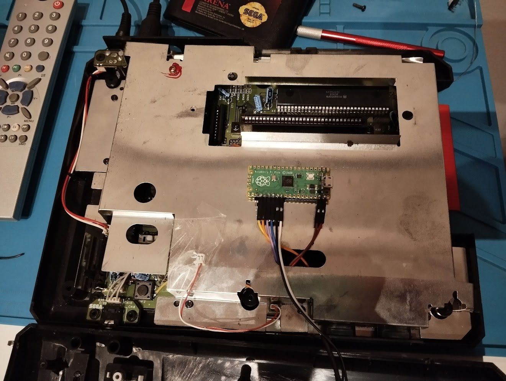

# megaPALadin

This is a switchless region mod for the SEGA Mega Drive, based on the Raspberry Pi Pico.



TODO review all of this

For now it is quite simple, allowing to change the region of the console via a reset button bypass.
Hold reset for half a second and release, to change desired region. The power LED will blink once for US, twice for EU, and three times for JP. Then do a quick press of the reset button to apply the setting and reset the console. Easy peasy.

Since this mod maintains the original power LED and communicates the region setting via quick blinking, there's no need to change anything about the external appearance of the console. It should look exactly the same after its done.

TODO :: Wireless controller functionality is planned for the future, when using a Pico W. I'm looking at [Bluepad32](https://github.com/ricardoquesada/bluepad32) as the joystick host solution, that seems to support a wide variety of controllers and just recently added support for the Pico W. OTA via wireless is already implemented but is subject to change. That's mostly why the board was installed atop the RF shielding, with velcro strips.

For more info on this mod, and the thought process, check out TODO, and maybe also [this post](https://camargo.eng.br/blog/2023/11-18-pal-megadrive.html) for the first version.

## BUILDING

TODO

```
$ git submodule update --init --recursive   # pico-sdk pulls in a lot of submodules, it's ok though
$ mkdir build && cd build
$ cmake ..
$ make
```

megapaladin.uf2 is in the build folder

## FLASHING

use uf2 file for initial installation

plug usb cable in computer keeping BOOTSEL button held

copy uf2 file into the disk device that appears

umount disk

## INSTALLING

OLD: An installation diagram is provided [here](doc/install%20plan.png). It is for VA 6.5, check out other switchless mod install guides for other revisions/models.
