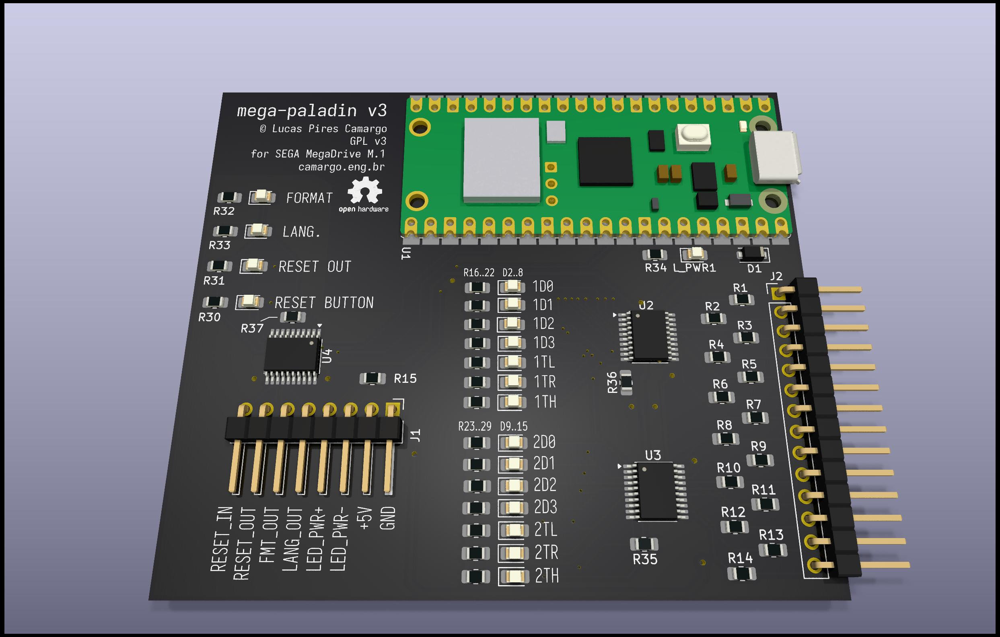

# mega-paladin v3 (WIP)

This is a switchless region mod for the SEGA Mega Drive, and a bluetooth controller host and adapter, based on the Raspberry Pi Pico W.

**NOTE**: firmware pin assignments are still for v2, and bluetooth controller support is incomplete. To be able to interface with the ports fast enough, the PIO peripheral will be necessary, and only v3 allows for that. The v3 hardware design has been completed and the first sample is now being built. Ass soon as it is done, firmware development will be completed, with v3 as the sole target. No big hardware changes are expected at this point.



*TODO:* review all of this, applies to v1 and v2.

For now the mod is quite simple, allowing to change the region of the console via a reset button bypass.
Hold reset for half a second and release, to change desired region. The power LED will blink once for US, twice for EU, and three times for JP. Then do a quick press of the reset button to apply the setting and reset the console. Easy peasy.

Since this mod maintains the original power LED and communicates the region setting via blinking, there's no need to change anything about the external appearance of the console. It should look exactly the same after installation.

WIP WIP WIP :: Wireless controller functionality is coming along, when using a Pico W. [Bluepad32](https://github.com/ricardoquesada/bluepad32) is working well as the joystick host solution, and it supports a wide variety of controllers.

What is missing now is interfacing with 

For more info on this mod, and the thought process, check out TODO, and maybe also [this post](https://camargo.eng.br/blog/2023/11-18-pal-megadrive.html) for the first version.

## BUILDING

Install dependencies for `pico-sdk`. They were `cmake gcc-arm-none-eabi libnewlib-arm-none-eabi build-essential` at time of writing (on Arch).

```
$ git submodule update --init --recursive   # pico-sdk pulls in a lot of submodules, it's ok though
$ mkdir build && cd build
$ cmake ..
$ make
```

megapaladin.uf2 should be in the build folder, ready to be flashed.

## FLASHING

use uf2 file for initial installation

plug usb cable in computer keeping BOOTSEL button held

copy uf2 file into the disk device that appears

umount disk

## INSTALLING

An installation diagram is provided [here](doc/install%20plan.png). **(It needs updating for V3!)** It is for VA 6.5, check out other switchless mod install guides for other revisions/models.
