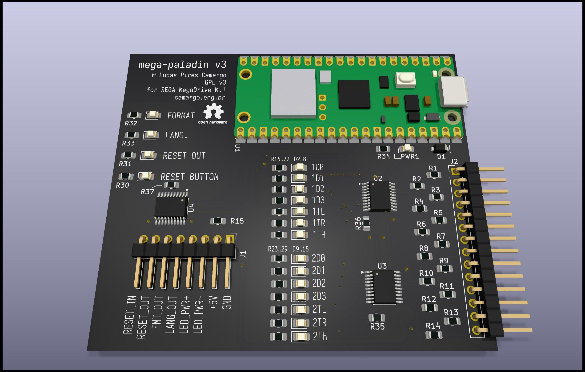

# mega-paladin v3 (WIP)

This is a switchless region mod for the SEGA Mega Drive, and a bluetooth controller host and adapter, based on the Raspberry Pi Pico W.



For now the mod is quite simple, allowing to change the region of the console via a reset button bypass.
Hold reset for half a second and release, to change desired region. The power LED will blink once for US, twice for EU, and three times for JP. Then do a quick press of the reset button to apply the setting and reset the console. Easy peasy.

Since this mod maintains the original power LED and communicates the region setting via blinking, there's no need to change anything about the external appearance of the console. It should look exactly the same after installation.

WIP WIP WIP :: Wireless controller functionality is coming along, when using a Pico W. [Bluepad32](https://github.com/ricardoquesada/bluepad32) is working well as the joystick host solution, and it supports a wide variety of controllers.

PIO for proper controller port interfacing is on the way.

For more info on this mod, and the thought process, check out TODO, and maybe also [this post](https://camargo.eng.br/blog/2023/11-18-pal-megadrive.html) for the first version.


## Building

Install dependencies for `pico-sdk`. They were `cmake gcc-arm-none-eabi libnewlib-arm-none-eabi build-essential` at time of writing (on Arch).

```
$ git submodule update --init --recursive   # pico-sdk pulls in a lot of submodules, it's ok though
$ mkdir build && cd build
$ cmake ..
$ make
```

`megapaladin.uf2` should be in the `build` folder, ready to be flashed.


## Flashing

For the first flashing, proceed as if flashing any other Pico W device via UF2. Namely:

+ use uf2 file for initial installation
+ plug usb cable in computer keeping BOOTSEL button held
+ copy uf2 file into the disk device that appears
+ umount disk

Further flashing of modified firmware after initial setup can be done with:

```sh
picotool load -f -x build/megapaladin.elf
```

`picotool` may have to be installed separately.

Use `sudo` if there are permission errors reported (most likely missing `udev` rules, if on Linux). Check the `pico-sdk` and/or the `picotool` documentation for more info.

## Hardware Installation

An installation diagram is provided [here](doc/install%20plan.png). **(It needs updating for V3!)** It is for VA 6.5, check out other switchless mod install guides for other revisions/models.

## Warnings

### Connect the USB cable only when the Mega Drive is on

The 5V supply side should be protected from reverse-feeding the console via a diode. Also, the level shifters should maintain a high-impedance state on the 5V side when the console is off.

This was tested a couple of times. I cannot guarantee this behavior, though! Weird leakage could happen, potentially damaging your console. 

You have been warned.

## License

This project is licensed under the GPL v3. See the [LICENSE](LICENSE) file for more information.

## Troubleshooting

If you encounter issues with region switching or controller connectivity, try the following steps:

- Ensure that the reset button is being properly bypassed, and that the reset button output is cut off from feeding the IO controller's reset line.
- Double-check all wiring and solder joints.
- Ensure the Pico W is properly flashed and powered.
- Verify the reset button timing as described in the usage section.
- Consult the [Bluepad32 documentation](https://github.com/ricardoquesada/bluepad32) for controller pairing issues.

## Contributing

Contributions are welcome! Please open issues or submit pull requests for bug fixes, improvements, or new features.

## Contact

For questions or feedback, open an issue on GitHub or reach out via [the github issues page](https://github.com/lucaspcamargo/megapaladin/issues).